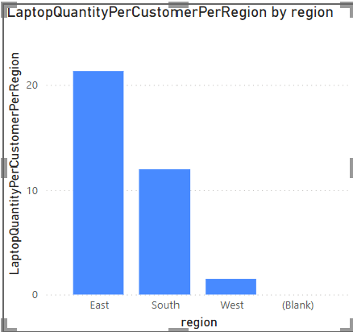
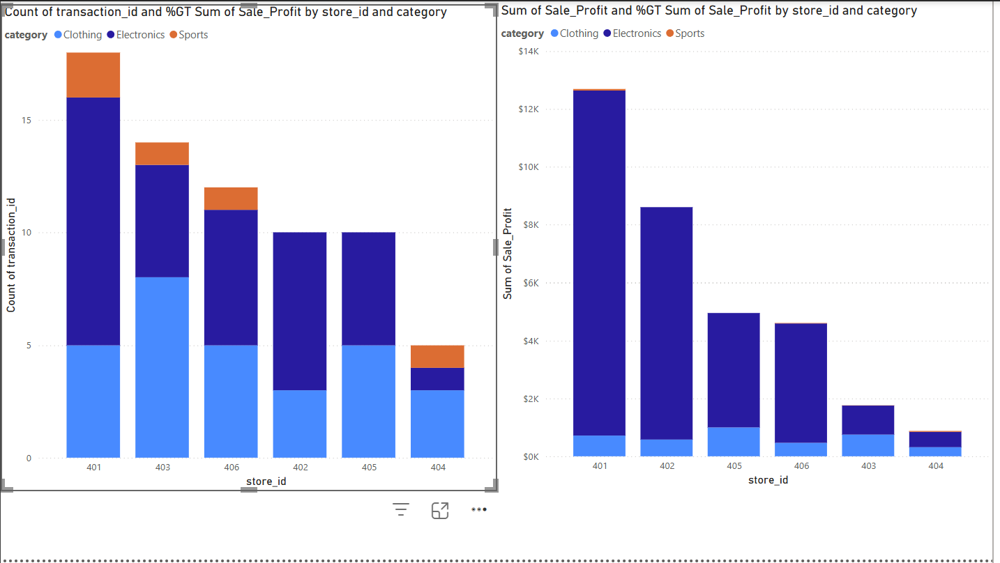
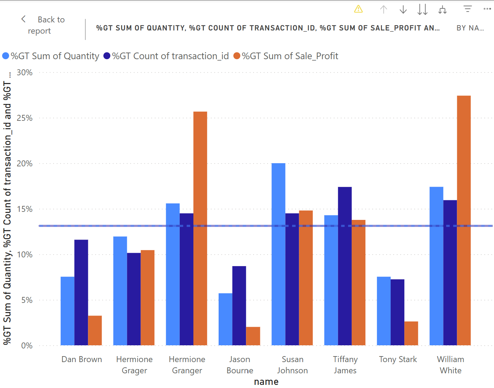

# P6. BI Insights and Storytelling
This separte README was established specifically to focus on the culminating analysis project with the smart_store dataset. Instructions for project set up and ETL can be found at https://github.com/matthewpblock/smart-store-block/blob/main/README.md

## Section 1. The Business Goal
Operational Objective: Build a targeted marketing that increases profits.  
Analytical Objective: Identify segments of the customer list can can be targeted in specific ways to increase profits. Provide recommendations for segmented messaging and a tracking mechanism to assess effectiveness.  
Initial options for targeting segmentation:
- By region
- By store
- Personalized down to the individual customer  

Emphasis: Analysis should focus on profit, not gross revenue.

## Section 2. Data Source
Data is sourced from the data warehouse created for earlier assignments in this same repository.  
#TODO        Clearly indicate which columns of which tables were used.

## Section 3. Tools
Analysis is being done within PowerBI to increase skill with this tool, both for personal proficiency and to gain knowledge to share with others.

## Section 4. Workflow & Logic
#TODO Describe the dimensions and aggregations - the logic needed for your analysis
### Profit Margin
To meet the objective of focusing on profits over gross revenue, a new calculated data point was required. Column `profit_margin` was created in the `products` table by subtracting `wholesale_price` from `unit_price`.  

### Profit per Transaction
Because the `sales` table records contain varying quantities of items sold, a new calculated data point for `quantity` was also required. This was created by dividing the `sale_amount` from the `sales` table by the `unit_price` from the `products` table for the corresponding `product_id` using the formula:  
```
Quantity = 
DIVIDE(
    sales[sale_amount], 
    LOOKUPVALUE(
        products[unit_price], 
        products[product_id], 
        sales[product_id]
    ), 
    0 )
```  
With `quantity` established, `sale_profit` could be calculated by mulitiplying `quantity` by `profit_margin` with the formula:  
```
Sale_Profit = 
sales[Quantity] * 
LOOKUPVALUE(
    products[profit_margin], 
    products[product_id], 
    sales[product_id]
)
```

### Most Profitable Products
Now that the required data points exist, I started analysis by looking to see which products were driving the most profits, with the notion that promoting high-profit products could move the needle faster. If there's a segment of our customer base who haven't bought our high-profit products yet, that could be low-hanging-fruit for targeted marketing. One product stood out:  
  
The slice for laptops looms over all other products; it is clearly the most profitable product. Using the Legend colors in the stacked column graph to dice out by `region` it also becomes apparent that not all regions are buying laptops evenly.
        **Regions with low laptop sales may benefit from targeted laptop marketing.**

#### Checking customer distribution by region
With geographical breakdowns, there's usually the risk of seeing what looks like is a useful disparity but is actually just reflecting the population distribution. It's possible we are selling laptops equally well everywhere but the East region stands out purely because we have more customers there. To check, I calculated laptops sold per customer and sliced by region:  
  
Seeing this, we know the East region is in fact selling more laptops per customer and that the South Region is also doing well to a lesser extent.  
        **The West and North regions sell substantially fewer laptops and could be the regions to target for increased laptop sales.**

#### Missing Data
Sidebar: These graphs contain a section titled "blank" where the region is unknown. Because we filtered outliers earlier in the project with customer ages outside a given range, some sales have a `customer_id` but there is no corresponding record in the `customers` table. This should spur a review of the reasons for the filtering, as some customer data may have been inappropriately filtered. Alternatively, if the customers in question are too young to be legally marketed to online it would make sense to ignore the "blank" column for our objective. For this academic project, I pressed forward without relitigating the outlier filters.

### More Segmentation Options
We've found some opportunity to target marketing by region. Our analytical objective also identified that we should look at store and customer level data for potential targeting options as well.
#### Store-level data
To examine store-level data, I looked at the number of transactions sliced out by store and the amount of profit sliced out by store:  
  
- Store 401 leads the way in both categories
- Store 402 is high on profit, but lower on transaction numbers. **This store may benefit from marketing to increase number of transactions.**
- Stores 405, 406, and especially 403 have high transaction numbers, but lower profits. **These stores would benefit from marketing promoting laptops to their existing customer base.**
- Store 404 is a low-performer in both transaction numbers and profit.  

        Caveat: Without amplifying information on these stores, it is difficult to assess what qualities of a store might lead to strong or poor performance. **A dimension table with store data might be a useful addition to our data warehouse.**
#### Customer-level data
To look for customer targeting opportunities, I sliced the data by customer and looked at number of transactions, quantity of items purchased, and profit generated:  
  
The y-axis is expressed as percentages of the whole for each data point in order to normalize the ranges for comparison.
- Hermione Granger and William White are above average in all three categories and disproportionately generate profits. **These are the most valuable customers.**
- Dan Brown, Jason Bourne, and Tony Stark all generate disproportionately small profits compared to their purchases. **Promoting the highest-profit item to these customers may bring in more profit.**

## Section 5. Results Recap
- The West and North regions sell substantially fewer laptops and could be the regions to target for increased laptop sales to increase profits.
- Store 402 is high on profit, but lower on transaction numbers. **This store may benefit from marketing to increase number of transactions.**
- Stores 405, 406, and especially 403 have high transaction numbers, but lower profits. **These stores would benefit from marketing promoting laptops to their existing customer base.**
- A dimension table with store data might be a useful addition to our data warehouse.
- Hermione Granger and William White are the most valuable customers. Market to them as you would to your VIPs.
- Dan Brown, Jason Bourne, and Tony Stark all generate disproportionately small profits compared to their purchases. **Promoting laptops to these customers may bring in more profit.**  

## Section 6: Suggested Business Action 
1. Establish regional marketing campaigns promoting laptop sales targeting the North and West regions.
2. Recognize VIP customers to promote continued customer relationship.
3. Send personalized marketing promoting laptops to low-profit customers.
4. Build `stores` table into data warehouse to enable analysis of what store characteristics correlate to success.
5. Review ETL filtering decisions. Some data may have been inappropriately filtered as outliers, possibly impacting the conclusions drawn here.

## Section 7. Challenges
        Mention any challenges you encountered and how they were resolved.
