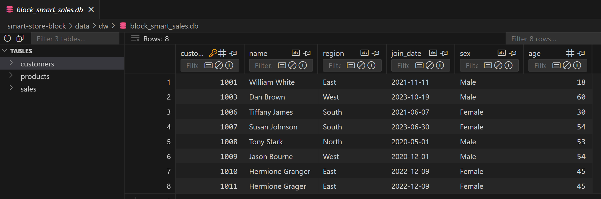
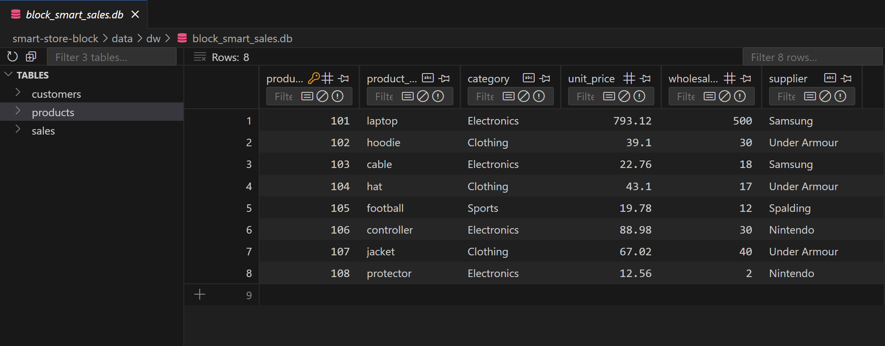
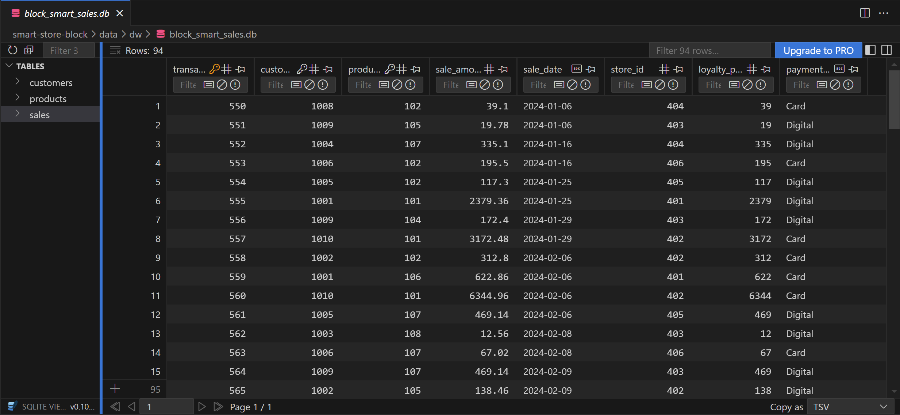
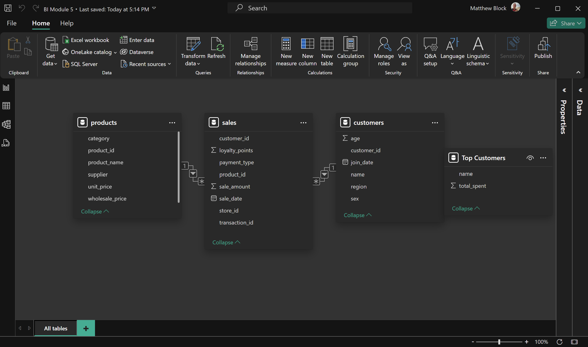
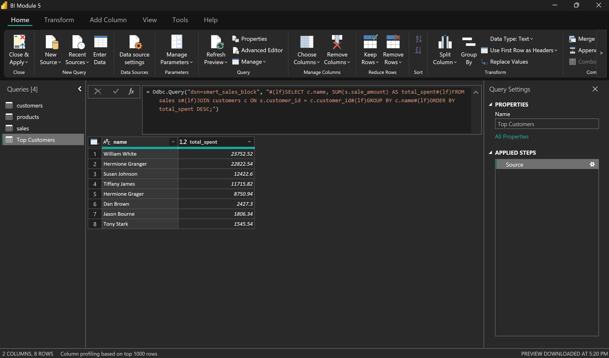
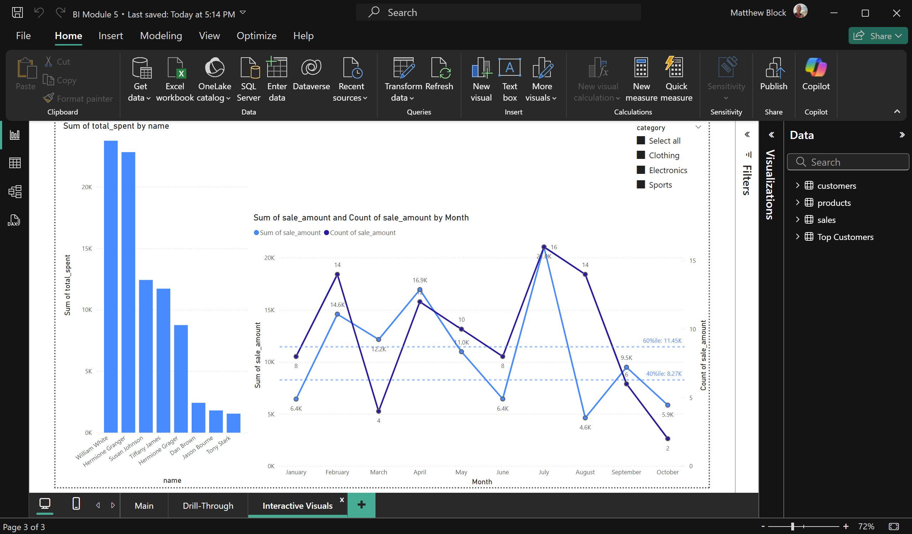

# Smart-Store-Block
## Description
This project was created for the Business Intelligence and Analytics course under the instruction of Dr. Denise Case as part of the M.S. in Data Analytics program at Northwest Missouri State University.  
It builds a data warehouse using python and SQL scripts to Extract, Transform, and Load data originating in multiple CSVs to an sqlite database.
- dwbuilder.py was designed to be a reusable module for building databases or data warehouses from CSVs. I plan to incorporate more functions for other source types in the future.
- etl_to_dw.py was designed to be a minimized script employing the functions from dwbuilder to build the data warehouse or database, where the items unique to the project (i.e. table names, file paths, etc.) can be easily updated and the script run for various projects.
- schema.sql is customized to the data required for this project including primary and foreign keys
- logger.py defines the logging functions

## Project Setup Guide (Windows)

Run all commands from a PowerShell terminal in the root project folder.

### Step 2A - Create a Local Project Virtual Environment

```shell
py -m venv .venv
```

### Step 2B - Activate the Virtual Environment

```shell
.venv\Scripts\activate
```

### Step 2C - Install Packages

```shell
py -m pip install --upgrade -r requirements.txt
```

### Step 2D - Optional: Verify .venv Setup

```shell
py -m datafun_venv_checker.venv_checker
```

### Step 2E - Run the initial project script

```shell
py scripts/data_prep.py
```

-----

## Initial Package List
- pip
- loguru
- ipykernel
- jupyterlab
- numpy
- pandas
- matplotlib
- seaborn
- plotly
- pyspark==4.0.0.dev1
- pyspark[sql]
- git+https://github.com/denisecase/datafun-venv-checker.git#egg=datafun_venv_checker

## Execution Commands
```scripts\data_preparation\prepare_customers_data.py```
```scripts\data_preparation\prepare_products_data.py```
```scripts\data_preparation\prepare_sales_data.py```

## Script Descriptions

### prepare_customers_data.py
- Checks the columns based on the arguments set
- Removes duplicates
- Filters out records with ages below 13 or above 150

### prepare_products_data.py
- Checks the columns based on the arguments set (including converting WholesalePrice field to float)
- Removes duplicates### prepare_sales_data.py

### prepare_sales_data.py
- Checks the columns based on the arguments set
- Removes duplicates
- Filters out records with SaleDate before 1 Jan 2000

## Data Warehouse Schema
This project aggregates data from three CSVs into a combined SQLite data warehouse, with each CSV populating a table. The sales/transaction data serves as the fact table and the other data serve as the dimension tables.  
You can see the the schema with foreign key connections in the following screenshots:  
-   Customers Table
-   Products Table
-   Sales Table

## Loading into Microsoft PowerBI
The SQLite database was connected to Microsoft PowerBI using SQLite ODBC Driver from: https://www.ch-werner.de/sqliteodbc/

Queries and reports were built to comply with assigment objectives.
### PowerBI Model View


### Query results


### Final Dashboard
